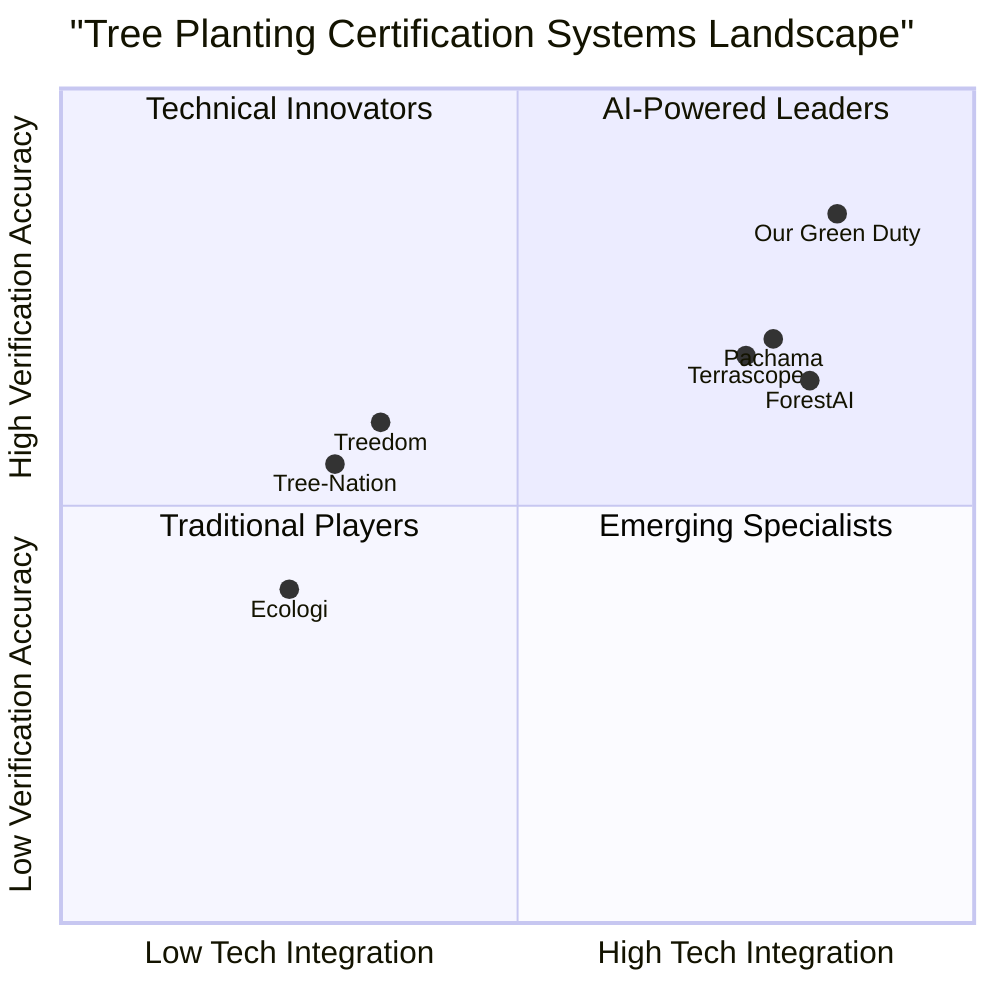

# Green Duty - Product Requirements Document

**Project Name:** Green Duty  
**Document Version:** 1.0  
**Created By:** Emma - Product Manager  
**Date:** July 13, 2025

## Original Requirements

Build a "Green Duty" system with three APIs that will analyze tree images with geolocation data to evaluate and certify tree planting efforts:

1. An API to process geotagged tree images with latitude and longitude
2. An API that integrates with Gemma 3n model (via Ollama) to detect tree species and age
3. An API that evaluates tree planting based on various criteria

The frontend will provide latitude, longitude, and three pictures of the tree. The system will use the Gemma 3n model from Ollama for vision tasks to detect tree species and age.

Trees will be evaluated based on:
- Fruit trees will receive good points
- Crop plants will receive no points
- Trees that absorb oxygen from the environment will receive negative points
- Check if another tree exists in that exact location or within a small distance
- Evaluate if the tree species is suitable for that geographic location

The system should provide feedback:
- Signal if another type of tree should be planted instead
- Provide suggestions for better tree planting

All data needs to be saved in a database.

## 1. Product Definition

### 1.1 Product Goals

1. **Environmental Impact Assessment**: Create a robust system that accurately evaluates the environmental impact of tree planting efforts through species identification, age estimation, and geographical suitability analysis.

2. **Data-Driven Planting Guidance**: Provide actionable recommendations for optimal tree planting based on species characteristics, location suitability, and environmental impact scoring.

3. **Certification Platform**: Establish a standardized certification system for tree planting initiatives that promotes sustainable forestry practices and incentivizes positive environmental contributions.

### 1.2 User Stories

1. **As a** tree planting organization, **I want to** upload geotagged images of newly planted trees **so that** I can receive certification and verification of my planting efforts.

2. **As a** environmental scientist, **I want to** analyze tree planting data across different regions **so that** I can assess the ecological impact and carbon sequestration potential.

3. **As a** land manager, **I want to** receive recommendations on suitable tree species for specific locations **so that** I can optimize the environmental benefits of reforestation projects.

4. **As a** government official, **I want to** verify the claims of tree planting initiatives in my jurisdiction **so that** I can ensure compliance with environmental regulations and sustainability goals.

5. **As a** corporate sponsor of tree planting initiatives, **I want to** access certified data on tree planting outcomes **so that** I can quantify the environmental impact of my sustainability investments.

### 1.3 Competitive Analysis

#### 1.3.1 Treedom
**Pros:**
- Well-established platform for tracking tree planting
- Connects tree planters with sponsors
- Provides GPS coordinates for each tree

**Cons:**
- Limited AI-powered species identification
- Manual verification process
- No real-time feedback on planting decisions

#### 1.3.2 Pachama
**Pros:**
- Uses satellite imagery to verify forest carbon
- Strong scientific backing for carbon calculations
- Blockchain-based verification

**Cons:**
- Focused on existing forests rather than new plantings
- Limited species-specific guidance
- No integration with on-the-ground planting operations

#### 1.3.3 Ecologi
**Pros:**
- User-friendly interface
- Regular planting updates
- Transparent reporting

**Cons:**
- Limited technical verification
- No species suitability analysis
- Generalized rather than location-specific recommendations

#### 1.3.4 ForestAI
**Pros:**
- Uses computer vision for forest monitoring
- Tracks forest health over time
- Detailed analytics

**Cons:**
- Focused on forest management rather than planting certification
- Limited feedback for individual tree planting decisions
- Requires significant technical expertise to operate

#### 1.3.5 Tree-Nation
**Pros:**
- Global planting projects
- Species information database
- Social engagement features

**Cons:**
- Limited AI-powered verification
- Manual processing of planting reports
- No automated suitability analysis

#### 1.3.6 Terrascope
**Pros:**
- Satellite-based monitoring
- Advanced carbon sequestration models
- Corporate reporting tools

**Cons:**
- Lacks individual tree-level granularity
- No real-time planting guidance
- Limited integration with field operations

#### 1.3.7 The Green Duty System (Our Target Product)
**Pros:**
- AI-powered species identification and age estimation
- Geographical suitability analysis
- Real-time feedback and recommendations
- Comprehensive scoring system for environmental impact
- Integrated certification process

**Cons:**
- New entrant in the market
- Requires three images per tree (more data collection effort)
- Dependent on Gemma 3n model accuracy

### 1.4 Competitive Quadrant Chart



## 2. Technical Specifications

### 2.1 Requirements Analysis

The Green Duty system requires three interconnected APIs that work together to process tree images, identify species and age, and evaluate planting efforts. The system will integrate with the Gemma 3n model from Ollama for computer vision tasks, requiring specific engineering to ensure efficient model usage and accurate results.

The system must be able to:
1. Process multiple images of a single tree from different angles
2. Analyze geolocation data to determine appropriate species for the location
3. Check for existing trees in close proximity to prevent overcrowding
4. Evaluate the environmental impact of the planted tree species
5. Generate meaningful recommendations for future planting
6. Store all collected data for reporting and analysis

Key technical challenges include:
- Integration with the Gemma 3n model for species identification and age estimation
- Development of an environmental scoring algorithm based on tree characteristics
- Implementation of geographical suitability checking based on climate and soil data
- Creation of a database schema that efficiently stores tree data, images, and evaluation results

### 2.2 Requirements Pool

#### P0 (Must Have)
1. API endpoint for uploading geotagged images with latitude/longitude data
2. Integration with Gemma 3n model for species identification
3. Basic environmental scoring algorithm (fruit trees vs. crop plants)
4. Database storage for tree data, including location, species, and images
5. User authentication system
6. Basic reporting interface

#### P1 (Should Have)
1. Tree age estimation using Gemma 3n model
2. Proximity checking for existing trees
3. Geographic suitability analysis based on tree species requirements
4. Detailed recommendations for alternative species when appropriate
5. API documentation and developer portal
6. Admin dashboard for system management

#### P2 (Nice to Have)
1. Machine learning model for predicting tree growth in specific locations
2. Carbon sequestration calculator based on species and age
3. Time-series analysis of tree growth over multiple submissions
4. Mobile app integration
5. Social sharing features for certified trees
6. Integration with carbon credit marketplaces

### 2.3 API Design

#### 2.3.1 API 1: Image Processing API
**Endpoint:** `/api/v1/upload`  
**Method:** POST  
**Authentication:** Required  
**Description:** Handles image uploads with geolocation data

**Request Parameters:**
```json
{
  "latitude": "float (required)",
  "longitude": "float (required)",
  "images": [
    "base64_encoded_image_1 (required)",
    "base64_encoded_image_2 (required)",
    "base64_encoded_image_3 (required)"
  ],
  "user_id": "string (required)",
  "planting_date": "date (optional)",
  "additional_notes": "string (optional)"
}
```

**Response:**
```json
{
  "upload_id": "string",
  "status": "string",
  "timestamp": "datetime",
  "message": "string"
}
```

#### 2.3.2 API 2: Tree Analysis API
**Endpoint:** `/api/v1/analyze`  
**Method:** POST  
**Authentication:** Required  
**Description:** Processes uploaded images using the Gemma 3n model

**Request Parameters:**
```json
{
  "upload_id": "string (required)"
}
```

**Response:**
```json
{
  "analysis_id": "string",
  "species": {
    "common_name": "string",
    "scientific_name": "string",
    "confidence": "float"
  },
  "estimated_age": {
    "years": "float",
    "confidence": "float"
  },
  "status": "string",
  "timestamp": "datetime"
}
```

#### 2.3.3 API 3: Certification API
**Endpoint:** `/api/v1/certify`  
**Method:** POST  
**Authentication:** Required  
**Description:** Evaluates the analyzed tree data and provides certification results

**Request Parameters:**
```json
{
  "analysis_id": "string (required)"
}
```

**Response:**
```json
{
  "certification_id": "string",
  "environmental_score": "float",
  "score_breakdown": {
    "species_type": "float",
    "geographic_suitability": "float",
    "proximity_to_other_trees": "float"
  },
  "recommendations": [
    {
      "type": "string",
      "description": "string",
      "priority": "integer"
    }
  ],
  "certification_status": "string",
  "timestamp": "datetime"
}
```

### 2.4 Database Schema

The database will need to store the following key entities:

#### Users Table
- user_id (Primary Key)
- username
- email
- password (hashed)
- organization
- created_at
- last_login

#### Tree Uploads Table
- upload_id (Primary Key)
- user_id (Foreign Key)
- latitude
- longitude
- planting_date
- upload_timestamp
- additional_notes
- status

#### Tree Images Table
- image_id (Primary Key)
- upload_id (Foreign Key)
- image_url
- image_type (angle perspective)
- upload_timestamp

#### Tree Analysis Table
- analysis_id (Primary Key)
- upload_id (Foreign Key)
- species_common_name
- species_scientific_name
- species_confidence
- estimated_age
- age_confidence
- analysis_timestamp
- model_version

#### Tree Certification Table
- certification_id (Primary Key)
- analysis_id (Foreign Key)
- environmental_score
- species_score
- geographic_suitability_score
- proximity_score
- certification_status
- certification_timestamp
- expiration_date

#### Recommendations Table
- recommendation_id (Primary Key)
- certification_id (Foreign Key)
- recommendation_type
- description
- priority
- created_at

#### Geographic Suitability Rules Table
- rule_id (Primary Key)
- species_scientific_name
- min_latitude
- max_latitude
- min_longitude
- max_longitude
- min_elevation
- max_elevation
- soil_types
- climate_zones
- precipitation_requirements
- temperature_requirements
- created_at
- updated_at

### 2.5 Integration with Gemma 3n Model

The system will integrate with the Gemma 3n model from Ollama, which has multimodal capabilities for image analysis. Based on research, we'll use the Gemma 3n E4B model variant (8 billion raw parameters) for optimal performance in tree species identification and age estimation.

**Integration Requirements:**
1. Server must have appropriate hardware to run the Gemma 3n model locally
2. Ollama runtime environment must be configured and tested
3. API requests to the model should be rate-limited to prevent overloading
4. Caching mechanisms should be implemented for frequently requested species
5. Error handling for model unavailability or low confidence predictions
6. Version tracking for model updates

**Model Initialization Process:**
```python
# Pseudocode for Gemma 3n model initialization
import ollama

def initialize_model():
    try:
        model = ollama.load("gemma3n:e4b")
        return model, True
    except Exception as e:
        logger.error(f"Failed to initialize Gemma 3n model: {e}")
        return None, False

# Usage
model, success = initialize_model()
if success:
    # Proceed with API initialization
else:
    # Fall back to alternative processing or alert administrators
```

### 2.6 UI Design Draft

While the project focuses on API development, a simple UI is necessary for testing and demonstration. The UI should include:

1. **Upload Interface:**
   - File dropzone for tree images
   - Map interface for verifying/adjusting coordinates
   - Form fields for additional metadata

2. **Results Dashboard:**
   - Species identification results with confidence scores
   - Age estimation with confidence range
   - Environmental score with breakdown
   - Geographic suitability indicators
   - Proximity analysis results

3. **Recommendations Panel:**
   - Alternative species suggestions
   - Planting guidance
   - Improvement opportunities

4. **Certification View:**
   - Certificate preview
   - Downloadable certification document
   - Sharing options

### 2.7 Open Questions

1. **Oxygen Absorption Criteria:** The requirement states that "trees that absorb oxygen from the environment will receive negative points." This is scientifically unusual since trees generally produce oxygen through photosynthesis and absorb carbon dioxide. Clarification is needed on this evaluation criterion.

2. **Proximity Definition:** What is the specific minimum distance required between trees for the proximity check? This may vary by species and should be defined.

3. **Model Accuracy Expectations:** What are the minimum acceptable accuracy thresholds for species identification and age estimation?

4. **Tree Age Estimation Method:** How will the model determine tree age from images alone? Will additional data like trunk diameter be required?

5. **Scaling Considerations:** What is the expected volume of API requests, and what performance requirements exist for response times?

6. **Data Retention Policy:** How long should tree images and analysis results be stored?

7. **Offline Functionality:** Should the system support offline image collection with later synchronization?

## 3. Implementation Plan

### 3.1 Phase 1: Core Infrastructure (Weeks 1-2)
- Set up development environment
- Implement database schema
- Create basic API structure
- Configure Gemma 3n model integration

### 3.2 Phase 2: Core Functionality (Weeks 3-5)
- Implement image upload and processing API
- Develop species identification with Gemma 3n
- Create basic certification algorithm
- Build initial UI for testing

### 3.3 Phase 3: Advanced Features (Weeks 6-8)
- Implement geographic suitability analysis
- Develop proximity checking
- Create recommendation engine
- Enhance certification algorithm

### 3.4 Phase 4: Testing and Refinement (Weeks 9-10)
- Conduct system testing
- Optimize model performance
- Refine UI/UX
- Address security concerns

### 3.5 Phase 5: Documentation and Launch (Weeks 11-12)
- Complete API documentation
- Create user guides
- Prepare for production deployment
- Conduct final QA testing

## 4. Metrics and Success Criteria

### 4.1 Performance Metrics
- API response time < 2 seconds for image upload
- Analysis completion time < 10 seconds per tree
- Species identification accuracy > 85%
- Age estimation accuracy within ±2 years for young trees
- System uptime > 99.5%

### 4.2 Business Metrics
- Number of trees certified
- User adoption rate
- Repeat usage statistics
- Geographic distribution of certified trees
- Average environmental score improvement over time

## 5. Appendix

### 5.1 Glossary

- **Gemma 3n**: A multimodal AI model from Google, deployed via Ollama, capable of processing image and text data
- **Environmental Score**: A numerical value assigned to a tree planting based on species, location, and other factors
- **Geographic Suitability**: The appropriateness of a particular tree species for a given location based on climate, soil, and other environmental factors
- **Proximity Check**: Analysis to determine if the tree being planted is too close to existing trees
- **Species Identification**: The process of determining tree species from images using the Gemma 3n model

### 5.2 References

1. Computer Vision Models for Tree Species Recognition (2024)
2. Geographic Suitability Factors for Tree Species
3. Tree Planting Best Practices: Spacing Requirements (2024)
4. Gemma 3n Model Documentation