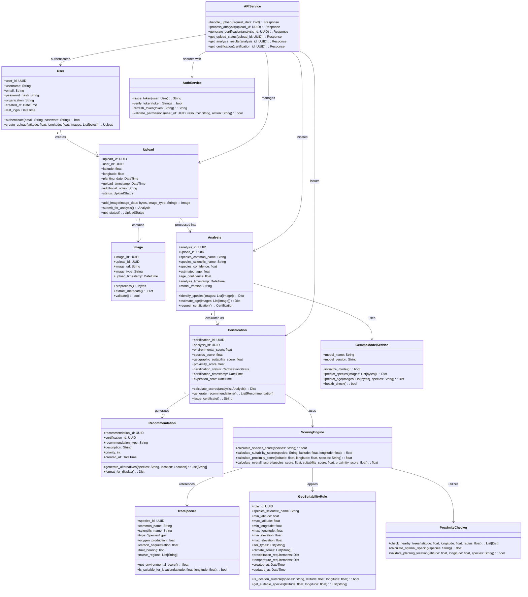
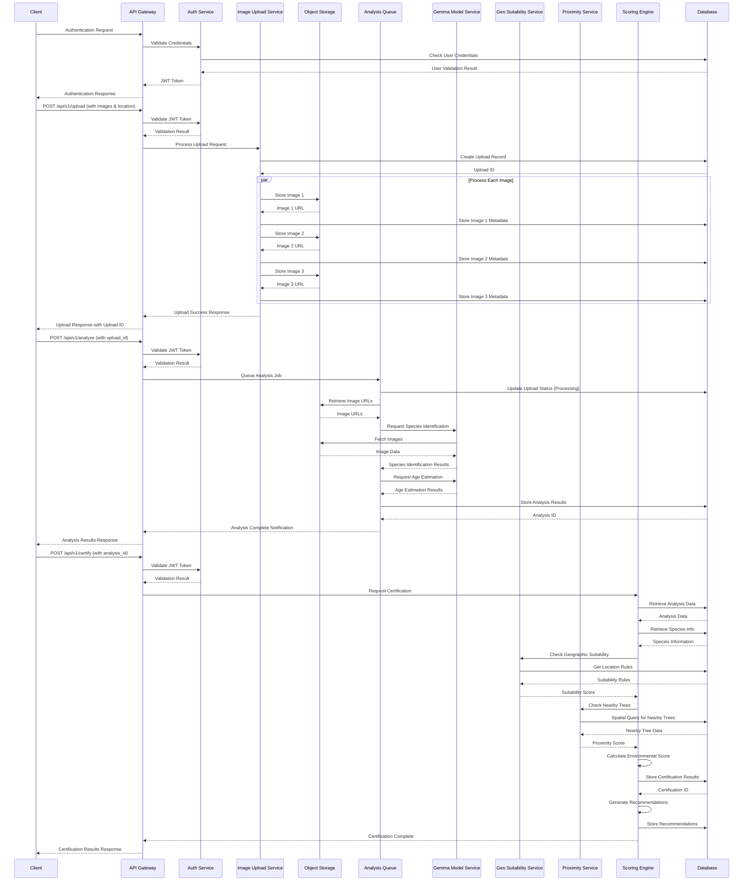
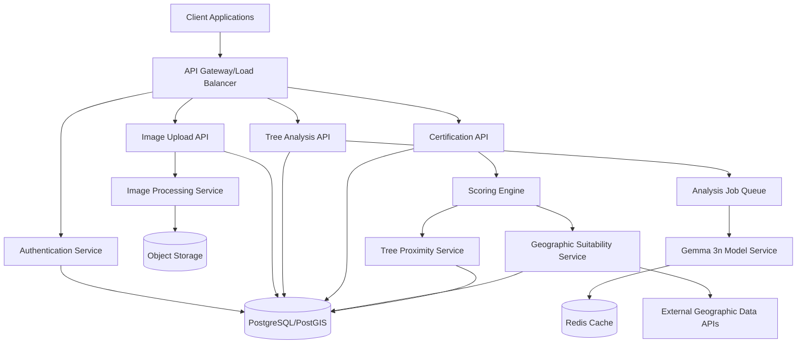

# Green Duty System Design

## Implementation approach

After analyzing the requirements from the PRD, we'll implement the Green Duty system as a modular, scalable application with the following technical approach:

### Technology Stack
- **Backend Framework**: FastAPI (Python) for high-performance API endpoints
- **Database**: PostgreSQL with PostGIS extension for geospatial data handling
- **Image Processing**: OpenCV and Pillow for image preprocessing
- **ML Integration**: Ollama client for Gemma 3n model integration
- **Caching**: Redis for model prediction caching and rate limiting
- **Authentication**: JWT-based authentication system
- **Containerization**: Docker for consistent deployment
- **Orchestration**: Kubernetes for scaling and management
- **Storage**: Object storage (S3-compatible) for image files

### Key Technical Challenges and Solutions

1. **Gemma 3n Model Integration**
   - Solution: Create a dedicated microservice for model interactions, enabling isolation and scalability
   - Implement prediction caching to improve performance for common tree species
   - Use asynchronous processing queue for handling batch analysis requests

2. **Geographic Suitability Analysis**
   - Solution: Integrate with open-source climate and soil databases
   - Implement a rule-based engine for species-location matching
   - Cache geographic data by region for faster lookups

3. **Spatial Analysis for Tree Proximity**
   - Solution: Utilize PostGIS spatial queries for efficient nearby tree detection
   - Implement configurable proximity rules based on tree species characteristics

4. **Environmental Scoring Algorithm**
   - Solution: Create a configurable scoring matrix for different tree types
   - Implement a weighted scoring system that considers species, location, proximity, and growth potential
   - Build an extensible framework to accommodate future scoring criteria

5. **Image Processing Pipeline**
   - Solution: Implement preprocessing to standardize images before ML analysis
   - Extract metadata from images including EXIF data where available
   - Create a validation system to ensure image quality and angle diversity

## Data structures and interfaces

The system will be structured with the following core components and interfaces:

## Program call flow

The system interaction flow for the three main API endpoints:

## System Architecture

### Component Diagram

## Deployment Strategy

The Green Duty system will be deployed using a containerized microservices architecture:

1. **Containerization**
   - Each service will be packaged as a Docker container
   - Standard base images will ensure consistency across environments
   - Container health checks and monitoring will be implemented

2. **Kubernetes Orchestration**
   - Service pods will auto-scale based on load
   - Resource limits to prevent single service overconsumption
   - Rolling updates for zero-downtime deployments
   - Readiness and liveness probes for service health

3. **Multi-Environment Setup**
   - Development environment for feature development
   - Testing environment for QA and integration testing
   - Staging environment mimicking production
   - Production environment with enhanced security and monitoring

4. **Database Deployment**
   - PostgreSQL with PostGIS as a managed service or in-cluster stateful set
   - Regular automated backups
   - Read replicas for scaling query performance

5. **Model Deployment**
   - Dedicated high-performance nodes for running Gemma 3n model
   - GPU acceleration where available
   - Model versioning and A/B testing capabilities

6. **Infrastructure as Code**
   - Terraform for provisioning cloud resources
   - Helm charts for Kubernetes deployments
   - Configuration management via Kubernetes ConfigMaps and Secrets

## Security Considerations

1. **API Security**
   - JWT-based authentication for all API endpoints
   - Role-based access control (RBAC) for different user types
   - API rate limiting to prevent abuse
   - Input validation and sanitization
   - HTTPS/TLS for all communications

2. **Data Security**
   - Encryption at rest for all data storage
   - Data anonymization for reporting purposes
   - Proper handling of personally identifiable information (PII)
   - Secure deletion policies for removed data

3. **Model Security**
   - Isolation of model service from public networks
   - Input validation to prevent adversarial attacks
   - Monitoring for unusual prediction patterns

4. **Infrastructure Security**
   - Network segmentation and firewall rules
   - Kubernetes pod security policies
   - Regular security scans and patching
   - Principle of least privilege for service accounts

5. **Compliance and Auditing**
   - Comprehensive logging for all system operations
   - Audit trail for certification issuance
   - Regular security audits and penetration testing
   - Compliance with relevant data protection regulations

## Monitoring and Observability

1. **Service Monitoring**
   - Prometheus for metrics collection
   - Grafana dashboards for visualization
   - Alerting for critical service degradation

2. **Model Monitoring**
   - Track prediction accuracy and confidence scores
   - Monitor prediction latency and resource usage
   - Alert on drift or degradation in model performance

3. **User Experience Monitoring**
   - Track API response times
   - Monitor upload and processing success rates
   - Gather user feedback on recommendations

## Scalability Considerations

1. **Horizontal Scaling**
   - Stateless services designed for horizontal scaling
   - Database read replicas and connection pooling
   - Distributed caching for high-traffic data

2. **Batch Processing**
   - Asynchronous processing of image analysis tasks
   - Job queues with prioritization and fair scheduling
   - Parallelized processing where possible

3. **Geographic Distribution**
   - Edge caching for static resources
   - CDN integration for image delivery
   - Regional API endpoints for reduced latency

## Anything UNCLEAR

1. **Oxygen Absorption Criteria**: The PRD mentions "trees that absorb oxygen from the environment will receive negative points," which is scientifically unusual as trees generally produce oxygen and absorb carbon dioxide. This requirement needs clarification - perhaps it refers to certain plant species or specific environmental conditions.

2. **Scale of Deployment**: The expected request volume and user base size are not specified, which affects architectural decisions around scaling and performance optimization.

3. **Offline Capabilities**: Whether the system should support offline operation for field work in areas with limited connectivity is not clearly specified.

4. **Model Update Strategy**: How frequently the Gemma 3n model will be updated and how to handle backward compatibility for existing analyses needs clarification.

5. **Tree Proximity Definition**: The specific minimum distance required between trees needs to be defined, potentially as a species-specific parameter.

6. **Legal and Compliance Requirements**: Any specific legal requirements for tree certification or data handling should be clarified.